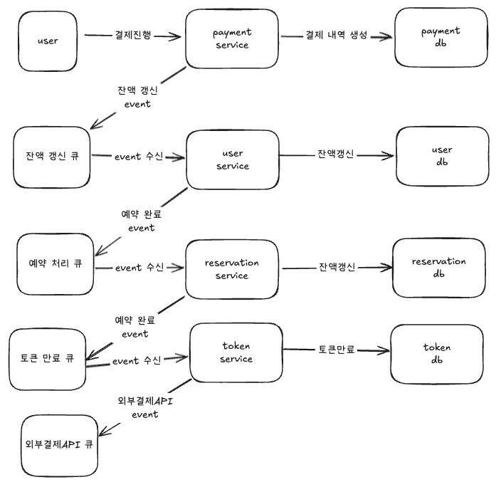

# 도메인별 MSA 형태로 배포 단위 분리에 따른 트랜잭션 처리의 한계와 해결방안

마이크로서비스 아키텍처(MSA, Microservices Architecture)는 복잡한 시스템을 여러 개의 독립된 서비스로 분리하여 개발하고 배포하는 방법론입니다.

각 서비스는 독립적인 배포 단위로 운영되며, 도메인별로 나누어져 있습니다.
이는 유지보수와 확장성, 배포의 효율성을 높이는 장점이 있지만, 트랜잭션 처리 측면에서 어려움이 있습니다.

이 문서에서는 도메인별 MSA 형태에서 배포 단위 분리로 인한 트랜잭션 처리의 한계와 이를 해결할 수 있는 방법들을 설명합니다.

## MSA에서의 트랜잭션 처리

우선 트랜잭션 처리를 전통적인 모놀리식 아니텍처에서는 어떻게 처리하였는지 생각해봐야합니다.

### 전통적인 트랜잭션 처리

전통적인 모놀리식 아키텍처에서는 데이터베이스 트랜잭션을 통해 여러 비즈니스 로직을 하나의 트랜잭션 내에서 처리할 수 있습니다.

이는 ACID 원칙을 기반으로 하여, 트랜잭션 내의 모든 작업이 성공적으로 완료되거나 전혀 수행되지 않도록 보장합니다.

예를 들어, 주문 처리 시스템에서 결제, 상품 재고 차감, 배송 상태 업데이트 등의 작업을 모두 하나의 트랜잭션으로 묶어서 처리할 수 있습니다.

### MSA에서의 트랜잭션 처리

MSA 환경에서는 각 서비스가 데이터베이스, 서비스 전부 독립적으로 운영되며, 서비스 간 통신을 통해 비즈니스 로직을 처리합니다.

이러한 분리된 환경에서는 한 서비스의 트랜잭션이 다른 서비스의 트랜잭션과 연관되거나 영향을 미치는 경우가 많습니다.

이로 인해 분산 트랜잭션이 필요하게 되며, 데이터베이스가 물리적으로 나눠져있기에 기존의 ACID 기반 트랜잭션 처리 방식만으로는 한계가 있습니다.

## 도메인별 배포 단위 분리에 따른 트랜잭션 처리의 한계

### 분산 트랜잭션 처리의 복잡성

MSA 환경에서는 서비스 간 트랜잭션을 보장하기 위해 여러 가지 방법을 사용할 수 있지만, 각 서비스가 자체적인 데이터베이스를 사용하고 독립적으로 배포되기 때문에 트랜잭션을 동기화하는 과정이 복잡해집니다.

- 트랜잭션 범위: 각 서비스에서 트랜잭션이 독립적으로 수행되므로, 여러 서비스에 걸친 트랜잭션을 관리하려면 각 트랜잭션의 상태를 정확히 추적하고 조정해야 합니다.
- 데이터 일관성: 트랜잭션이 여러 서비스에 걸쳐 수행되면, 각 서비스 간 데이터 일관성을 유지하는 것이 어려워집니다. 특히, 서비스 간 네트워크 지연이나 실패로 인해 일관성을 보장하는 데 어려움이 있습니다.

### 성능 및 확장성 저하

- 동기적 처리: 트랜잭션이 여러 서비스 간에 동기적으로 처리되면, 각 서비스 간의 네트워크 호출로 인해 지연 시간이 증가할 수 있습니다. 이로 인해 시스템의 성능이 저하되고, 서비스 간의 의존성이 강해져 확장성에 제한이 발생할 수 있습니다.
- 네트워크 장애: 서비스 간 통신이 네트워크를 통해 이루어지므로, 네트워크 장애나 서비스 간 연결 실패 시 전체 트랜잭션이 실패하거나 롤백될 수 있습니다.

### 데이터베이스 일관성 문제

각 서비스가 독립적인 데이터베이스를 사용하므로, 데이터베이스 간 일관성을 보장하는 것이 매우 어려워집니다.

예를 들어, A 서비스에서 결제 처리가 성공했지만, B 서비스에서 주문 상태 업데이트가 실패하는 경우, 데이터가 일관되지 않게 됩니다.

## 해결방안
대표적인 해결방안으로는 아래와 같습니다.

- SAGA 패턴 : 보상 트랜잭션을 활용해 최종적인 일관성을 보장하지만, 복잡한 롤백 로직이 필요함. 보상 트랜잭션 실행 주체에 따라서 Choreography 방식과 Orchestration 방식으로 나뉩니다.
- 이벤트 기반 비동기 처리 : 비동기적으로 트랜잭션을 처리하며 랜잭션 처리의 성능과 확장성을 향상시킬 수 있습니다.
- 2PC (Two-Phase Commit Protocol): 데이터 일관성을 보장하지만, 네트워크 비용이 크고 성능 저하 가능성이 있습니다.

### SAGA 패턴

SAGA 패턴은 분산 트랜잭션을 처리하는 데 매우 유용한 방식입니다. 이 패턴은 각 서비스의 트랜잭션을 작은 트랜잭션으로 나누고, 각 트랜잭션이 성공할 때마다 다음 트랜잭션을 호출합니다. 만약 하나의 트랜잭션이 실패하면, 이전에 완료된 트랜잭션들을 취소하거나 보상하는 방식으로 처리합니다.
- 보상 트랜잭션: 트랜잭션이 실패했을 때, 이전에 실행된 트랜잭션을 취소하는 보상 트랜잭션을 사용하여 일관성을 유지합니다.
- 장점: SAGA 패턴은 각 서비스가 독립적으로 트랜잭션을 처리하도록 하면서도, 전체적인 비즈니스 프로세스에서 일관성을 유지할 수 있습니다.

### 이벤트 기반 비동기 처리

MSA에서는 이벤트 기반 아키텍처를 사용하여 서비스 간의 결합도를 낮추고, 비동기적으로 트랜잭션을 처리할 수 있습니다. 이벤트 소싱(Event Sourcing)이나 CQRS(Command Query Responsibility Segregation) 패턴을 사용하면, 이벤트를 기반으로 상태를 변경하고, 트랜잭션을 비동기적으로 처리할 수 있습니다.
- 이벤트 발행과 처리: 각 서비스는 상태 변경을 이벤트로 발행하고, 다른 서비스는 이 이벤트를 처리하여 상태를 동기화합니다. 이 방법은 트랜잭션을 비동기적으로 처리할 수 있게 해주며, 네트워크 장애나 지연에 강한 특징을 가집니다.
- 장점: 서비스 간의 의존성을 최소화하고, 트랜잭션 처리의 성능과 확장성을 향상시킬 수 있습니다.

### 두단계 커밋(2PC) 및 장기 실행 트랜잭션

두단계 커밋(2PC)은 분산 시스템에서 트랜잭션을 관리하는 고전적인 방법으로, 모든 서비스가 트랜잭션을 완료할 준비가 되었을 때만 실제 커밋을 수행합니다. 이 방법은 트랜잭션의 일관성을 보장할 수 있지만, 성능에 영향을 줄 수 있습니다.
- 단점: 네트워크 지연과 트랜잭션 대기 시간이 길어지면 성능 저하가 발생할 수 있습니다.
- 장점: 모든 서비스가 동일한 트랜잭션 범위 내에서 작업을 처리하므로 데이터 일관성을 매우 철저하게 보장할 수 있습니다.

## 결론

도메인별 MSA에서 트랜잭션 처리의 한계는 서비스 간의 분리와 데이터 일관성의 문제를 위에 `나온 SAGA, 이벤트 기반 비동기 처리, 2PC` 등을 적절히 적용하여 각 요구사항에 맞는 트랜잭션 관리 방안을 모색해야합니다.

## 콘서트 예약 시스템에서 MSA 기반의 트랜잭션 구현 예시

콘서트 예약 시스템에서 좌석 결제 usecase에 대해 분산 트랜잭션을 구현한다면 어떻게 진행할지에 대한 예시입니다

```kotlin
@Transactional
fun executePayment(context: PaymentContext): ProcessPaymentResult {
    
    결제 처리()
    사용자 잔액 갱신()
    예약 상태 완료 처리()
    토큰 만료처리()
    외부결제API event 발행()
}
```

각 분산된 서비스의 트랜잭션을 event로 loose하게 풀고, event queue를 kafka를 활용하여 롤백 처리까지 고려하면 아래와 같은 그림을 그릴 수 있습니다.



