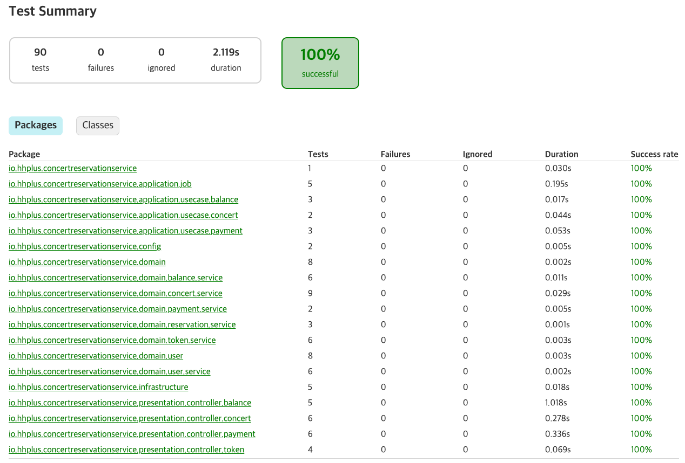
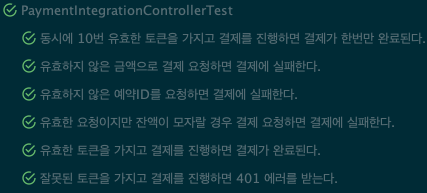

# 테스트 결과

## summary

## 진행방식

### happy case와 예외사항을 각 케이스 별로 주고 테스트 시나리오 작성

1. domain test
2. service layer test
3. usecase layer test
4. rest assured를 이용한 e2e test

- 좌석 결제에 대한 테스트 시나리오 예시

### multi instance 라는 가정하에 동시성 이슈가 발생할 있는 3개의 구간에서 동시성 테스트 진행
1. user 잔고 충전
2. 좌석 예약
3. 예약된 좌석 결제

