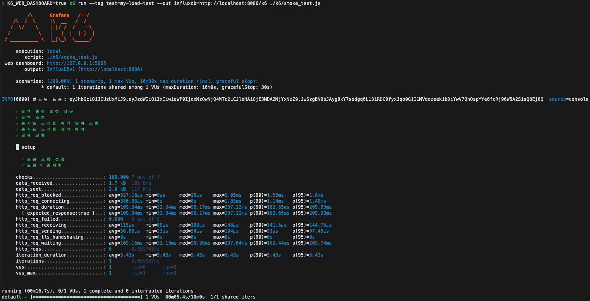
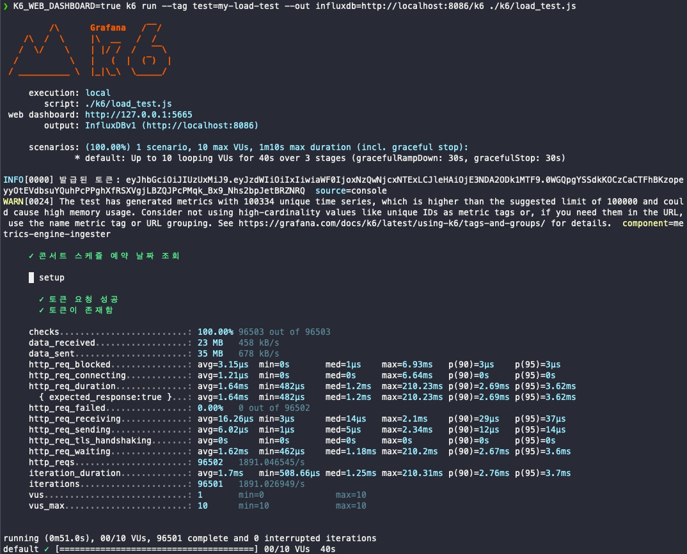
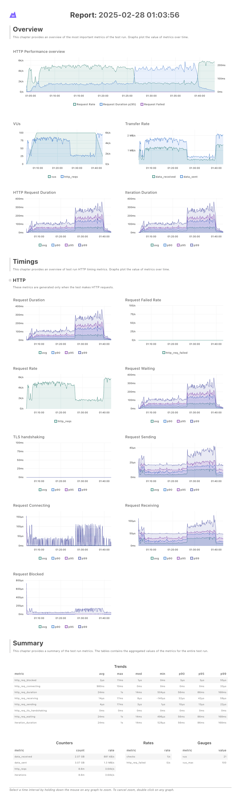

# 부하 테스트 보고서

## 1. 개요

### 목적

애플리케이션의 성능을 검증하고, 예상되는 부하에서의 동작을 분석하여 최적의 배포 스펙을 도출하는 것을 목표로 합니다.

콘서트 예약 서비스에서 시나리오에 대한 테스트는 진행하지않고, API의 성능 테스트를 smoke test, load test의 방식으로 진행합니다.

### 테스트 대상

토큰을 제외한 도메인은 모두 토큰이 발급된 후 API의 성능 테스트를 진행합니다.

- **서비스명**: `콘서트 예약 서비스`
- **테스트 목적**: API의 성능 평가
- **테스트 범위**: 테스트 범위는 아래의 API에 한합니다.
    - 토큰
        - `POST /reservation-token` : 토큰 발급
    - 결제
        - `POST /api/payment` : 결제 진행
    - 콘서트
        - `GET /api/concert/{concertId}/schedules/{scheduleId}/seats` : 콘서트 스케쥴 예약 날짜 조회
        - `POST /api/concert/{concertId}/schedules/{scheduleId}/reservations` : 콘서트 좌석 예약
    - 잔액
        - `GET /api/balance` : 잔액 조회
        - `POST /api/balance` : 잔액 충전

### 테스트 환경

| 항목                 | 사양                   |
|--------------------|----------------------|
| OS                 | 15.3.1(24D70)        |
| CPU                | Apple M4             |
| 메모리                | 24GB DDR4            |
| 데이터베이스             | MySQL 8.4.3 (Docker) |
| redis              | Redis 7.2.1 (Docker) |
| kafka cluster(3EA) | kafka 7.5.3 (Docker) |
| 부하 테스트 도구          | k6                   |

### 테스트 데이터

1. `User`: 1000명의 가짜 사용자 데이터를 생성합니다.
2. `Place`: 10개의 공연장을 생성합니다.
3. `Concert`: 20개의 콘서트를 생성합니다.
4. `ConcertSchedule`: 100개의 콘서트 일정을 생성합니다.
5. `ScheduleSeat`: 각 일정당 1개의 좌석 유형(UNDEFINED)을 생성합니다.
6. `Seat`: 좌석 유형별 좌석 수에 맞춰 좌석 데이터를 생성합니다.(현재는 50개씩 생성)

## 2. 테스트 시나리오 설계

### 테스트 상황 정의

1. smoke test
    - 실행 방식: token을 발급받고 API 테스트 진행
    - VU (Virtual Users): 1명
    - Iterations (반복 횟수): 1회

2. load test
    - 실행 방식: token을 발급받고 API 테스트 진행
    - VU (Virtual Users): 1명에서 점진적으로 100명까지 늘림.
    - Iterations (반복 횟수): 1회

- 최대 1000명의 사용자가 동시 예약을 시도하는 시나리오
- 트래픽 증가 방식: **스텝 부하 (Ramp-up Load)** 적용
- TPS 목표: **초당 500건**

### 테스트 조건

1. smoke test에서는 API가 정상작동하는지 테스트
2. load test에서는 부하를 점진적으로 증가시키는 방식으로 테스트 적용
3. Docker 실행 옵션을 조정하여 테스트 수행
    - ~~`--cpus=2 --memory=2g`~~
    - ~~`--cpus=4 --memory=4g`~~

### 테스트 스크립트

k6 폴더 하위에 `smoke_test.js`로 smoke test, `load_test.js`파일로 load test를 진행합니다.

## 3. 테스트 수행 및 결과

### 테스트 수행 과정

- 공통사항
    - `k6`을 사용하여 테스트 실행
    - ~~Docker 실행 옵션을 다르게 설정하여 성능 비교~~

### 성능 지표 분석

### 1. smoke test

- 테스트 요약
    - VU (Virtual Users): 1명
    - Iterations (반복 횟수): 1회
    - 총 요청 수: 6건
    - 성공률: 100% (실패 없음)
    - 테스트 소요 시간: 약 5.27초

- 주요 성능 지표
    - 평균 응답 시간: 64.18ms
    - 응답 실패율: 0% (모든 요청 성공)
    - 네트워크 지연 관련 항목(`http_req_blocked`, `http_req_connecting`)이 미미하므로 네트워크 성능에는 영향이 없음을 확인했습니다.
    - 데이터 전송 및 수신 속도: 매우 빠름

| 항목                    | 설명                               | 결과             | 분석            |
|-----------------------|----------------------------------|----------------|---------------|
| `http_req_duration`   | 요청-응답 전체 소요 시간                   | 평균 **64.18ms** | 비교적 빠름        |
| `http_req_waiting`    | 서버에서 실제 응답을 기다린 시간               | 평균 **64.08ms** | 네트워크 지연은 미미함  |
| `http_req_blocked`    | TCP 연결 전 대기 시간 (DNS, Connection) | 평균 **132µs**   | 매우 짧음 (정상)    |
| `http_req_connecting` | TCP 연결 시간                        | 평균 **69.5µs**  | 네트워크 연결 빠름    |
| `http_req_sending`    | 요청 데이터 전송 시간                     | 평균 **49.66µs** | 데이터 전송 빠름     |
| `http_req_receiving`  | 응답 데이터 수신 시간                     | 평균 **50.66µs** | 응답 데이터 크기가 작음 |
| `http_req_failed`     | HTTP 요청 실패 비율                    | **0.00%**      | **모든 요청 성공**  |

### 2. load test

부하 테스트는 단계별로 VU 및 시간을 나눠서 실행합니다.

- 테스트 요약
    - VU (Virtual Users): 10명
    - Iterations (반복 횟수): 96,503회
    - 총 요청 수: 96,502건
    - 성공률: 100% (실패 없음)
    - 테스트 소요 시간: 약 1분 10초

### 주요 성능 지표

- 평균 응답 시간: 1.64ms
- 응답 실패율: 0% (모든 요청 성공)
- 네트워크 지연 관련 항목(`http_req_blocked`, `http_req_connecting`)이 미미하므로 네트워크 성능에는 영향이 없음을 확인했습니다.
- 데이터 전송 및 수신 속도: 매우 빠름

| 항목                    | 설명                               | 결과             | 분석           |
|-----------------------|----------------------------------|----------------|--------------|
| `http_req_duration`   | 요청-응답 전체 소요 시간                   | 평균 **1.64ms**  | 매우 빠름        |
| `http_req_waiting`    | 서버에서 실제 응답을 기다린 시간               | 평균 **1.62ms**  | 네트워크 지연 미미   |
| `http_req_blocked`    | TCP 연결 전 대기 시간 (DNS, Connection) | 평균 **3.15µs**  | 매우 짧음        |
| `http_req_connecting` | TCP 연결 시간                        | 평균 **1.21µs**  | 네트워크 연결 빠름   |
| `http_req_sending`    | 요청 데이터 전송 시간                     | 평균 **6.02µs**  | 데이터 전송 속도 빠름 |
| `http_req_receiving`  | 응답 데이터 수신 시간                     | 평균 **16.26µs** | 응답 데이터 크기 작음 |
| `http_req_failed`     | HTTP 요청 실패 비율                    | **0.00%**      | **모든 요청 성공** |

- **테스트 요약**
    - VU (Virtual Users): 1명 -> 100명
    - Iterations (반복 횟수): 8.8백만회
    - 총 요청 수: 8.8백만회
    - 성공률: 100% (실패 없음)
    - 테스트 소요 시간: 약 40분

- **주요 성능 지표**
    - 평균 응답 시간(**23ms**)입니다.
    - 응답 실패율이 **0%**로 **정상 동작**함을 보장합니다.
    - 네트워크 지연 관련 항목(`http_req_blocked`, `http_req_connecting`)이 위의 짧은 부하 테스트 보단 증가했지만 전반적으로 낮으므로 **네트워크 성능에는 영향이 없음**을 확인했습니다.
    - 데이터 전송 및 수신 속도도 매우 빠르게 측정되었습니다.

| 항목                    | 설명                               | 결과           | 분석                            |
|-----------------------|----------------------------------|--------------|-------------------------------|
| `http_req_duration`   | 요청-응답 전체 소요 시간                   | 평균 **23ms**  | 매우 빠르진않음(짧은 시간의 부하테스트 보다 느려짐) |
| `http_req_waiting`    | 서버에서 실제 응답을 기다린 시간               | 평균 **23ms**  | 네트워크 지연 증가                    |
| `http_req_blocked`    | TCP 연결 전 대기 시간 (DNS, Connection) | 평균 **2µs**   | 매우 짧음                         |
| `http_req_connecting` | TCP 연결 시간                        | 평균 **980ns** | 네트워크 연결 빠름                    |
| `http_req_sending`    | 요청 데이터 전송 시간                     | 평균 **4µs**   | 데이터 전송 빠름                     |
| `http_req_receiving`  | 응답 데이터 수신 시간                     | 평균 **14µs**  | 응답 데이터 크기 작음                  |
| `http_req_failed`     | HTTP 요청 실패 비율                    | **0.00%**    | **모든 요청 성공**                  |

## 4. 결론 및 인사이트

### 결과 요약

부하 테스트 ramp up 구간은 무리 없이 수행되었습니다. 그러나, 100vu기준으로 부하테스트 시작 20분 부터 부하가 발생한 것으로 판단됩니다.

예약 조회의 경우

### 개선 및 추가 고려 사항

- **Redis 캐싱 도입**: 자주 조회되는 콘서트의 경우 캐싱 전략을 도입하여 성능 개선을 도모할 수 있습니다.

---

## 결론

smoke test, load test를 바탕으로 m4 ARM, 24GB 메모리, 100vu 환경에서 20분정도까지 성능이 원활한 것을 볼 수 있습니다.

그러나 20분 후에도 성능이 크게 이슈가 생길만큼의 latency가 발생하지 않았으나 캐싱 전략을 도입하여 추가적인 성능 개선이 가능할 것으로 판단됩니다.
