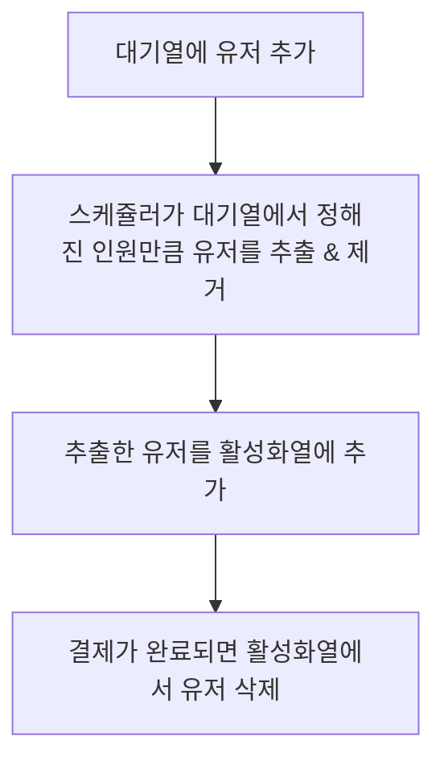
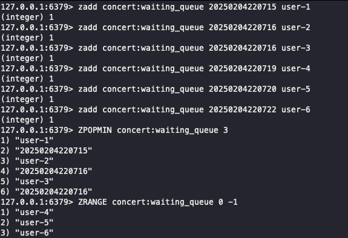
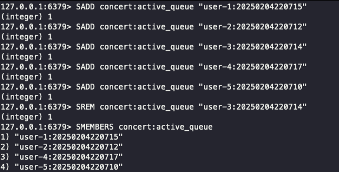

# cache & redis 적용
콘서트 예약 프로젝트에서 cache 및 redis를 적용 시킬 수 있는 usecase에 대해 정의합니다.

## 1. 대기열

### 대기열 구성

대기열은 콘서트별로 관리할 수 있도록 `concert:waiting_queue` 형태의 키를 사용하였습니다.

이 과정에서 단순한 큐(List 자료구조)도 고려할 수 있지만, 다중 서버 환경에서는 요청 순서가 반드시 보장되지 않으며,
클라이언트에서 먼저 요청을 보냈더라도 Redis에 늦게 반영될 가능성이 존재합니다.

따라서 순서 보장이 필수적인 대기열의 특성을 고려하여 `SortedSet`을 채택하였습니다.

### 활성화열 구성

활성화열은 순서가 필요하지 않기 때문에 Set 자료구조를 사용하여 구현하였습니다.

이를 통해 특정 유저가 활성화 상태인지 여부를 빠르게 조회하고 관리할 수 있습니다.

활성화열의 키는 대기열과 일관성을 유지하기 위해 동일한 네이밍 패턴인 `concert:active_queue`을 사용하였습니다.

### 대기열과 활성화열을 분리한 이유

대기열과 활성화열을 구분함으로써 더 효율적인 예약 시스템을 구현할 수 있습니다.

- 상태값을 직접 업데이트하는 방식 대신, 대기열과 활성화열을 분리하여 각 역할에 최적화된 자료구조를 활용할 수 있습니다.
- 불필요한 상태 변경 없이, 대기열에서는 순서를 보장하고, 활성화열에서는 빠른 접근성을 유지할 수 있습니다.
- 시스템 확장성과 유지보수성을 고려했을 때, 별도의 구조로 설계하는 것이 더욱 직관적이고 안정적인 방식이 됩니다.

또한 대기열과 활성화열을 나눈 이유는 `효율적`이기 때문입니다. redis에서 상태값을 계속 업데이트하는것이 아닌 각 대기열, 활성화열에 맞는 자료구조를 택하여 보다 효율적이면서 구현이 쉬워지기에 나눠서 개발하였습니다.

### 대기열 & 활성화열 흐름도


### 대기열 & 활성화열 redis 명령어
```shell
# 대기열에 유저 추가 : score에는 시간을 사용 (SortedSet 사용)
ZADD concert:waiting_queue <유입시각> <userToken>

# 대기열에서 유저를 정해진 혹은 요청한 만큼 꺼냄 & 삭제
ZPOPMIN concert:waiting_queue <N개>

# 꺼낸 유저를 활성화 목록에 추가 (Set 사용)
SADD concert:active_queue "<userToken>"

# 결제 완료시 유저 삭제
SREM concert:active_queue "<userToken>"

# 대기열 polling

```

### 대기열 관련 시나리오를 명령어로

- 대기열
```shell
# 콘서트 대기열에 user 유입
zadd concert:waiting_queue 20250204220715 user-1
zadd concert:waiting_queue 20250204220716 user-2
zadd concert:waiting_queue 20250204220716 user-3
zadd concert:waiting_queue 20250204220719 user-4
zadd concert:waiting_queue 20250204220720 user-5
zadd concert:waiting_queue 20250204220722 user-6

# 활성화할 유저만큼 pop
ZPOPMIN concert:waiting_queue 3

# 목록 확인
ZRANGE concert:waiting_queue 0 -1
```



- 활성화열
```shell
# 활성화열에 유저 추가(user:만료시간)
SADD concert:active_queue "user-1:20250204220715"
SADD concert:active_queue "user-2:20250204220712"
SADD concert:active_queue "user-3:20250204220714"
SADD concert:active_queue "user-4:20250204220717"
SADD concert:active_queue "user-5:20250204220710"

# 스케쥴러에 의해 유저 삭제
SREM concert:active_queue "user-3:20250204220714"

# 목록 확인
SMEMBERS concert:active_queue
```

    


[//]: # (## 임시 예약&#40;5분간&#41;)

[//]: # (```mermaid)

[//]: # (graph TD)

[//]: # (    Q[예약 완료] --> R[Redis에 임시 예약 저장_ttl 5분])

[//]: # (    R --> S[결제 완료시 결제완료 DB 저장])

[//]: # (    S --> T[임시 예약 내역 캐시 삭제])

[//]: # (```)

[//]: # ()
[//]: # (```shell)

[//]: # (# 임시 예약 상태 저장 &#40;SETEX를 사용하여 TTL 설정, String 사용&#41;)

[//]: # (SETEX concert:temp_reservation:<seatId>:<userId> 300 "reserved"  # 5분 동안 유지)

[//]: # ()
[//]: # (# 결제 완료 시 상태 갱신)

[//]: # (SET concert:temp_reservation:<seatId>:<userId> "paid" EX 3600  # 결제 완료 후 상태 갱신)

[//]: # (```)


## 좌석 예약 : 분산락

`concert:scheduleId:seatNo`을 키로 분산락 구현

## 현재 usecase에는 없지만 추가로 적용 할 수 있는 usecase

### 1. 인기 공연순위
특정 기간 동안 예약 수 혹은 해당 콘서트의 조회수, 그리고 기간에 대한 적절한 가중치를 두고 인기 공연 TOP5를 가져올 수 있을 것 같습니다.
예약이 생성되는 시점이 아닌 결제가 완료되는 시점에 +1, 결제가 취소되면 -1을 하여 순위를 실시간 집계하거나, 배치로 인기순위를 캐싱할 수 있을 것 같습니다.

#### 실시간 집계
누적을 위해 `ZADD` 말고 `ZINCRBY` 사용

1. 결제가 완료되면 순위 +1
    ```shell
   ZINCRBY popular:concerts 1 "concert_123"  // 기존 점수 +1
   ```
2. 결제가 취소되면 순위 -1
    ```shell
   ZINCRBY popular:concerts 1 "concert_123"  // 기존 점수 -1
   ```
3. 점수와 함께 높은 순위로 조회
    ```shell
   ZREVRANGE popular:concerts 0 -1 WITHSCORES
   ```

#### 주기적 집계
10분에 한번 주기적으로 배치를 이용해 인기 순위를 캐시에 반영

1. 10분간 데이터 조회(현재 모델링과는 맞지 않은 쿼리..)
    ```sql
    SELECT concert_id, COUNT(*) as reservation_count
    FROM concert
    WHERE status = 'PAID'
    AND updated_at >= NOW() - INTERVAL 10 MINUTE
    GROUP BY concert_id;
    ```
2. 기존 점수에 최신 10분간 점수 합산하는 lua script
    ```lua
    local concert_id = KEYS[1]
    local new_count = tonumber(ARGV[1])
    
    redis.call('ZINCRBY', 'concert:popularity', new_count, concert_id)
    ```
   
### 시간에 따른 가중치 decay 적용
```lua
local decay_factor = tonumber(ARGV[1])  -- 감쇠율 (예: 0.9)
local keys = redis.call('ZRANGE', 'concert:popularity', 0, -1)  -- 모든 콘서트 ID 조회

for _, key in ipairs(keys) do
    local score = redis.call('ZSCORE', 'concert:popularity', key)  -- 현재 점수 조회
    local new_score = score * decay_factor  -- 감쇠 적용
    redis.call('ZADD', 'concert:popularity', new_score, key)  -- 새로운 점수 반영
end
```
