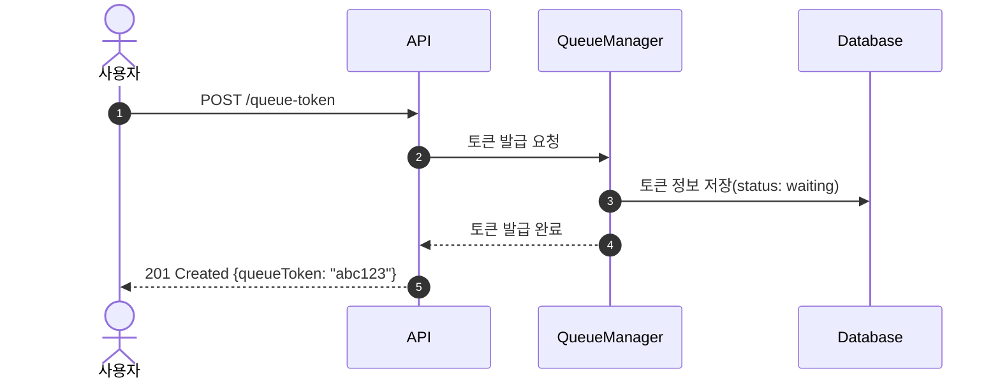
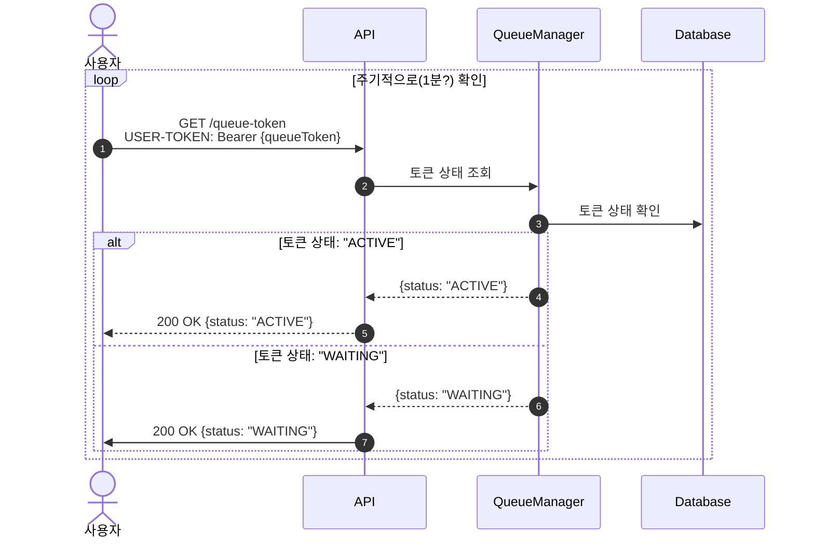
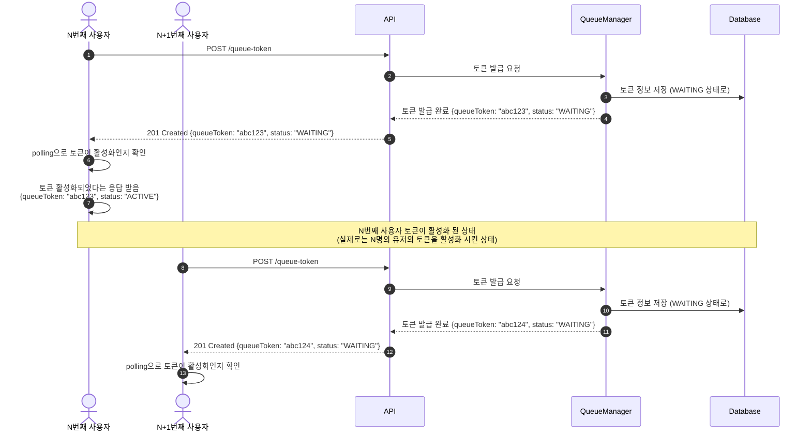
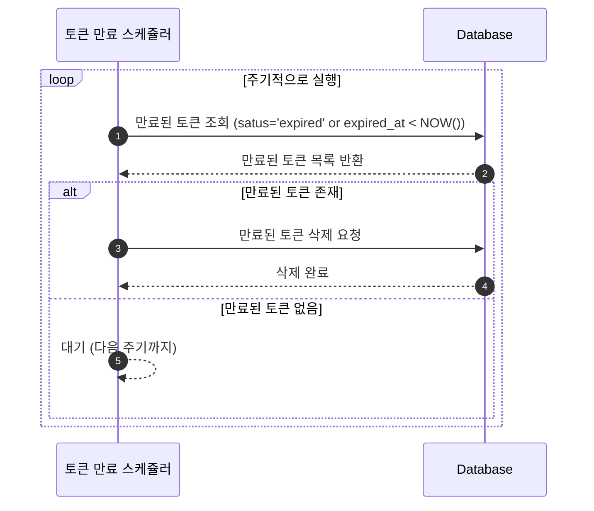
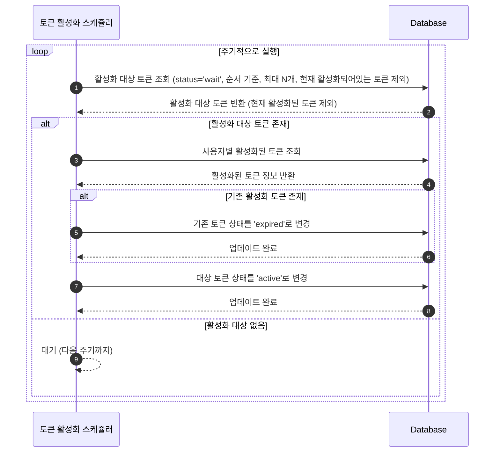
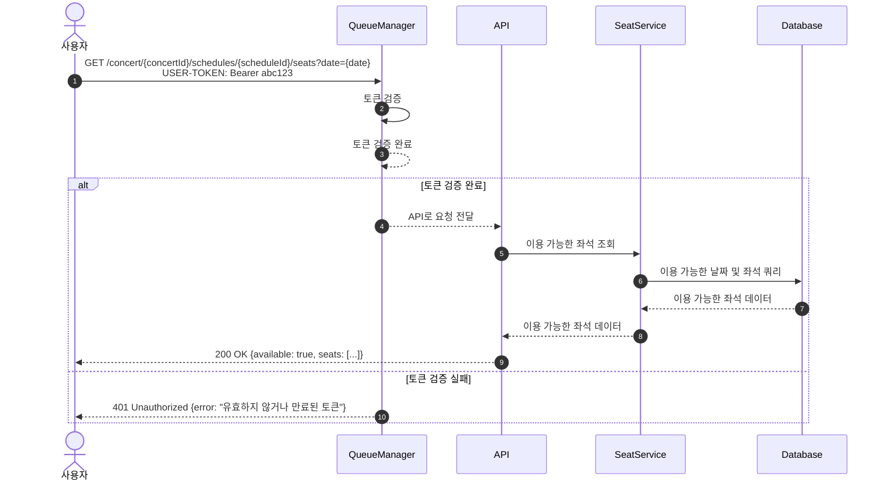
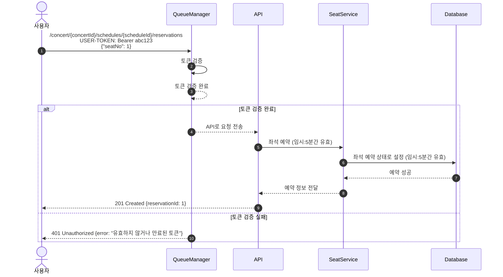
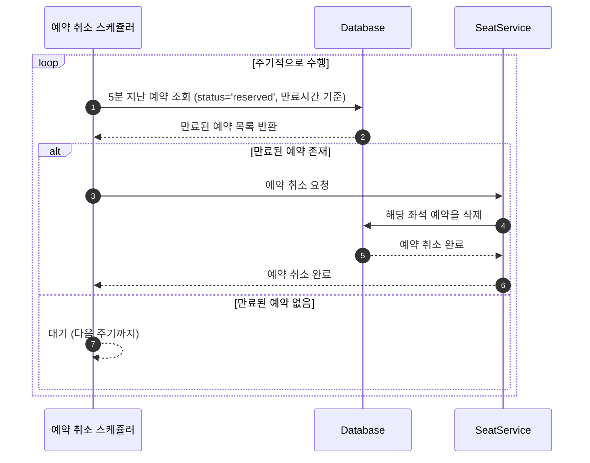
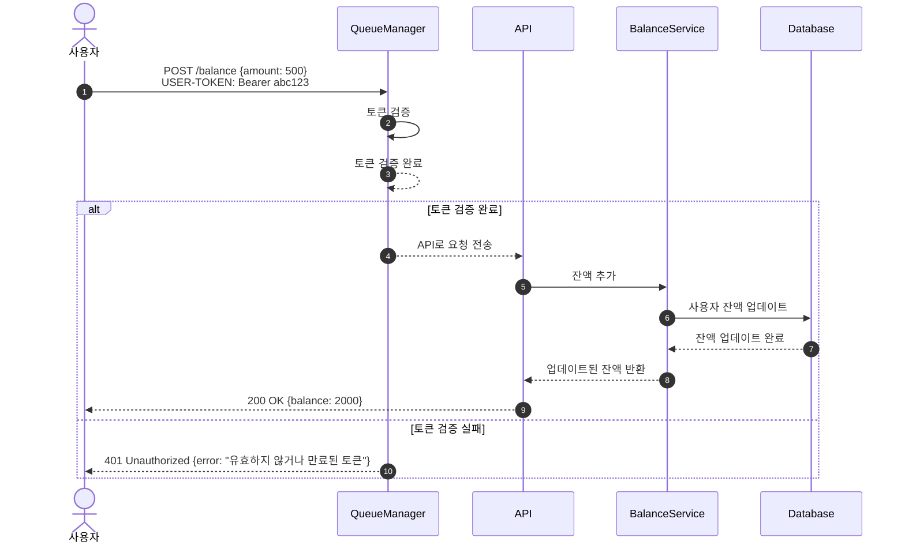
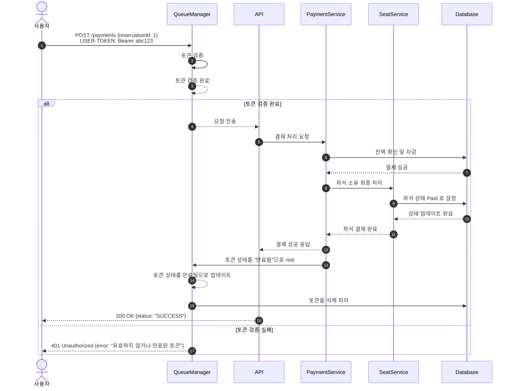

## 유저 토큰 발급

```mermaid
sequenceDiagram
    autonumber
    actor User as 사용자
    participant API
    participant QueueManager
    participant Database

    User ->> API: POST /queue-token
    API ->> QueueManager: 토큰 발급 요청
    QueueManager ->> Database: 토큰 정보 저장(status: waiting)
    QueueManager -->> API: 토큰 발급 완료
    API -->> User: 201 Created {queueToken: "abc123"}
```

## 유저 토큰 polling

```mermaid
sequenceDiagram
    autonumber
    actor User as 사용자
    participant API
    participant QueueManager
    participant Database

    loop 주기적으로(1분?) 확인
        User ->> API: GET /queue-token<br/> USER-TOKEN: Bearer {queueToken}
        API ->> QueueManager: 토큰 상태 조회
        QueueManager ->> Database: 토큰 상태 확인
        
        alt 토큰 상태: "ACTIVE"
            QueueManager -->> API: {status: "ACTIVE"}
            API -->> User: 200 OK {status: "ACTIVE"}
        else 토큰 상태: "WAITING"
            QueueManager -->> API: {status: "WAITING"}
            API ->> User: 200 OK {status: "WAITING"}
        end
    end
```

## 여러명의 유저의 토큰 발급(유저별로 wait 토큰 및 active 토큰을 받았을때)

```mermaid
sequenceDiagram
    autonumber
    actor User1 as N번째 사용자
    actor User2 as N+1번째 사용자
    participant API
    participant QueueManager
    participant Database

    User1 ->> API: POST /queue-token
    API ->> QueueManager: 토큰 발급 요청
    QueueManager ->> Database: 토큰 정보 저장 (WAITING 상태로)
    QueueManager -->> API: 토큰 발급 완료 {queueToken: "abc123", status: "WAITING"}
    API -->> User1: 201 Created {queueToken: "abc123", status: "WAITING"}
    User1 ->> User1: polling으로 토큰이 활성화인지 확인
    User1 ->> User1: 토큰 활성화되었다는 응답 받음 <br/> {queueToken: "abc123", status: "ACTIVE"}
    Note over User1,Database: N번째 사용자 토큰이 활성화 된 상태 <br/> (실제로는 N명의 유저의 토큰을 활성화 시킨 상태)
    User2 ->> API: POST /queue-token
    API ->> QueueManager: 토큰 발급 요청
    QueueManager ->> Database: 토큰 정보 저장 (WAITING 상태로)
    QueueManager -->> API: 토큰 발급 완료 {queueToken: "abc124", status: "WAITING"}
    API -->> User2: 201 Created {queueToken: "abc124", status: "WAITING"}
    User2 ->> User2: polling으로 토큰이 활성화인지 확인
```

## 토큰 만료 (스케쥴러)

```mermaid
sequenceDiagram
    autonumber
    participant Scheduler as 토큰 만료 스케쥴러
    participant Database

    loop 주기적으로 실행
        Scheduler ->> Database: 만료된 토큰 조회 (satus='expired' or expired_at < NOW())
        Database -->> Scheduler: 만료된 토큰 목록 반환

        alt 만료된 토큰 존재
            Scheduler ->> Database: 만료된 토큰 삭제 요청
            Database -->> Scheduler: 삭제 완료
        else 만료된 토큰 없음
            Scheduler -->> Scheduler: 대기 (다음 주기까지)
        end
    end
```

## 토큰 활성화 (스케쥴러)

```mermaid
sequenceDiagram
    autonumber
    participant Scheduler as 토큰 활성화 스케쥴러
    participant Database

    loop 주기적으로 실행
        Scheduler ->> Database: 활성화 대상 토큰 조회 (status='wait', 순서 기준, 최대 N개, 현재 활성화되어있는 토큰 제외)
        Database -->> Scheduler: 활성화 대상 토큰 반환 (현재 활성화된 토큰 제외)

        alt 활성화 대상 토큰 존재
            Scheduler ->> Database: 사용자별 활성화된 토큰 조회
            Database -->> Scheduler: 활성화된 토큰 정보 반환

            alt 기존 활성화 토큰 존재
                Scheduler ->> Database: 기존 토큰 상태를 'expired'로 변경
                Database -->> Scheduler: 업데이트 완료
            end

            Scheduler ->> Database: 대상 토큰 상태를 'active'로 변경
            Database -->> Scheduler: 업데이트 완료
        else 활성화 대상 없음
            Scheduler -->> Scheduler: 대기 (다음 주기까지)
        end
    end
```

## 예약 가능 날짜/좌석 조회

```mermaid
sequenceDiagram
    autonumber
    actor User as 사용자
    participant QueueManager
    participant API
    participant SeatService
    participant Database

    %% 예약 가능 날짜/좌석 조회 API
    User ->> QueueManager: GET /concert/{concertId}/schedules/{scheduleId}/seats?date={date}<br/> USER-TOKEN: Bearer abc123
    QueueManager ->> QueueManager: 토큰 검증
    QueueManager -->> QueueManager: 토큰 검증 완료
    alt 토큰 검증 완료
        QueueManager -->> API: API로 요청 전달
        API ->> SeatService: 이용 가능한 좌석 조회
        SeatService ->> Database: 이용 가능한 날짜 및 좌석 쿼리
        Database -->> SeatService: 이용 가능한 좌석 데이터
        SeatService -->> API: 이용 가능한 좌석 데이터
        API -->> User: 200 OK {available: true, seats: [...]}
    else 토큰 검증 실패
        QueueManager -->> User: 401 Unauthorized {error: "유효하지 않거나 만료된 토큰"}
    end
```

##  좌석 예약 요청

```mermaid
sequenceDiagram
    autonumber
    actor User as 사용자
    participant QueueManager
    participant API
    participant SeatService
    participant Database

    User ->> QueueManager: /concert/{concertId}/schedules/{scheduleId}/reservations<br/> USER-TOKEN: Bearer abc123<br/> {"seatNo": 1}
    QueueManager ->> QueueManager: 토큰 검증
    QueueManager -->> QueueManager: 토큰 검증 완료
    alt 토큰 검증 완료
        QueueManager -->> API: API로 요청 전송
        API ->> SeatService: 좌석 예약 (임시:5분간 유효)
        SeatService ->> Database: 좌석 예약 상태로 설정 (임시:5분간 유효)
        Database -->> SeatService: 예약 성공
        SeatService -->> API: 예약 정보 전달
        API -->> User: 201 Created {reservationId: 1}
    else 토큰 검증 실패
        QueueManager -->> User: 401 Unauthorized {error: "유효하지 않거나 만료된 토큰"}
    end
```

## 좌석 예약 자동 취소

```mermaid
sequenceDiagram
    autonumber
    participant Scheduler as 예약 취소 스케쥴러
    participant Database
    participant SeatService

    loop 주기적으로 수행
        Scheduler ->> Database: 5분 지난 예약 조회 (status='reserved', 만료시간 기준)
        Database -->> Scheduler: 만료된 예약 목록 반환

        alt 만료된 예약 존재
            Scheduler ->> SeatService: 예약 취소 요청
            SeatService ->> Database: 해당 좌석 예약을 삭제
            Database -->> SeatService: 예약 취소 완료
            SeatService -->> Scheduler: 예약 취소 완료
        else 만료된 예약 없음
            Scheduler -->> Scheduler: 대기 (다음 주기까지)
        end
    end
```

## 잔액 충전

```mermaid
sequenceDiagram
    autonumber
    actor User as 사용자
    participant QueueManager
    participant API
    participant BalanceService
    participant Database

    %% 잔액 충전 API
    User ->> QueueManager: POST /balance {amount: 500}<br/> USER-TOKEN: Bearer abc123
    QueueManager ->> QueueManager: 토큰 검증
    QueueManager -->> QueueManager: 토큰 검증 완료
    alt 토큰 검증 완료
        QueueManager -->> API: API로 요청 전송
        API ->> BalanceService: 잔액 추가
        BalanceService ->> Database: 사용자 잔액 업데이트
        Database -->> BalanceService: 잔액 업데이트 완료
        BalanceService -->> API: 업데이트된 잔액 반환
        API -->> User: 200 OK {balance: 2000}
    else 토큰 검증 실패
        QueueManager -->> User: 401 Unauthorized {error: "유효하지 않거나 만료된 토큰"}
    end
```

## 결제

```mermaid
sequenceDiagram
    autonumber
    actor User as 사용자
    participant QueueManager
    participant API
    participant PaymentService
    participant SeatService
    participant Database

    User ->> QueueManager: POST /payments {reservationId: 1}<br/> USER-TOKEN: Bearer abc123
    QueueManager ->> QueueManager: 토큰 검증
    QueueManager -->> QueueManager: 토큰 검증 완료
    alt 토큰 검증 완료
        QueueManager -->> API: 요청 전송
        API ->> PaymentService: 결제 처리 요청
        PaymentService ->> Database: 잔액 확인 및 차감
        Database -->> PaymentService: 결제 성공
        PaymentService ->> SeatService: 좌석 소유 최종 처리
        SeatService ->> Database: 좌석 상태 Paid 로 설정
        Database -->> SeatService: 상태 업데이트 완료
        SeatService -->> PaymentService: 좌석 결제 완료
        PaymentService -->> API: 결제 성공 응답
        PaymentService ->> QueueManager: 토큰 상태를 "만료됨"으로 noti
        QueueManager -->> QueueManager: 토큰 상태를 만료됨으로 업데이트
        QueueManager ->> Database: 토큰을 삭제 처리
        API -->> User: 200 OK {status: "SUCCESS"}
    else 토큰 검증 실패
        QueueManager -->> User: 401 Unauthorized {error: "유효하지 않거나 만료된 토큰"}
    end
```
